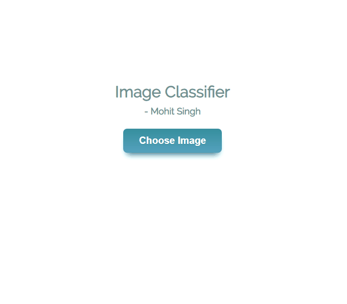

# Image Classifier Web Application
A web application that classifies images using models created by machine learning.

## Demo

## Instructions
1. Download the three files (index.html, index.js, styles.css) and ensure they are stored together in one folder.
2. Open index.html in a web browser.
3. Upload an image using the "Choose Image" button.
4. Click the "Predict" button.
5. The result will be displayed shortly after the loading wheel disappears.
